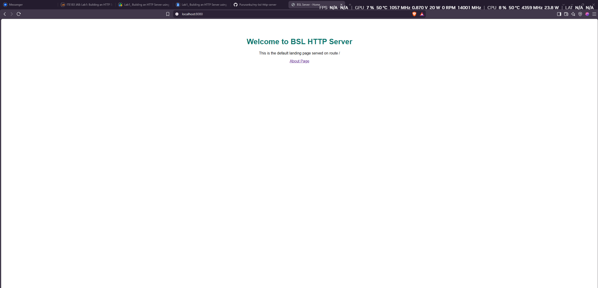
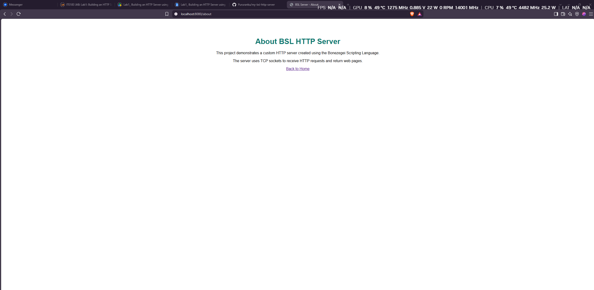
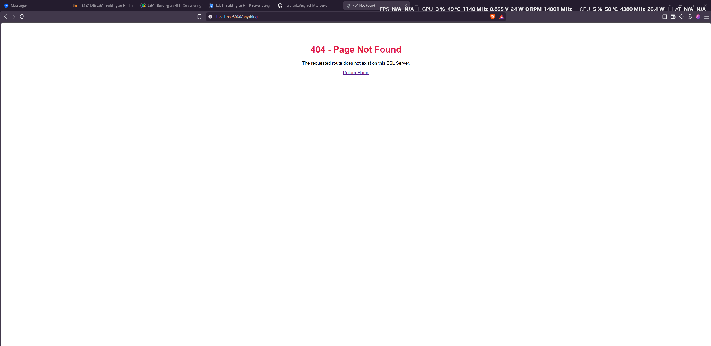
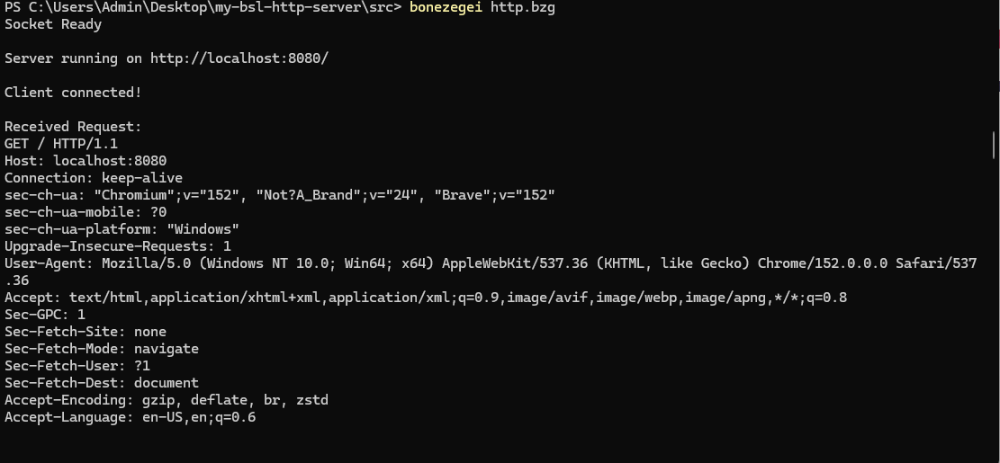

# BSL HTTP Server

A simple HTTP web server created using the **Bonezegei Scripting Language (BSL)** and the **BSL Socket Library**.

This project demonstrates how a basic web server receives HTTP requests from a browser, handles different routes, and returns the appropriate HTTP response.

## Project Description

The server runs locally on **port 8080** and uses TCP sockets to communicate with a web browser.

It supports the following routes:

| Route | Description | Response |
|---|---|---|
| `/` | Home page | `200 OK` |
| `/about` | About page | `200 OK` |
| Any other route | Custom error page | `404 Not Found` |

## Installation and Setup

### 1. Install Visual Studio Code

Install Visual Studio Code on your computer.

### 2. Install Bonezegei

In Visual Studio Code, open the Extensions tab and search for:

```text
Bonezegei
```

Install the Bonezegei extension and follow the instructions for installing the Bonezegei interpreter.

### 3. Install the Socket Library

Open a terminal inside the `src` folder and run:

```bash
bzg install socket
```

This creates the required socket library used by the HTTP server.

### 4. Run the Server

Navigate to the source folder:

```bash
cd src
```

Run the server using:

```bash
bonezegei http.bzg
```

When successful, the terminal will display:

```text
Socket Ready
Server running on http://localhost:8080/
```

Keep the terminal open while using the server.

## Usage

Open a web browser and visit the following addresses.

### Home Page

```text
http://localhost:8080/
```

This displays the default landing page and returns:

```text
HTTP/1.1 200 OK
```

### About Page

```text
http://localhost:8080/about
```

This displays information about the BSL HTTP Server project and returns:

```text
HTTP/1.1 200 OK
```

### 404 Page

Visit an unknown route such as:

```text
http://localhost:8080/anything
```

The server displays a custom error page and returns:

```text
HTTP/1.1 404 Not Found
```

## How the Server Works

The program performs the following basic process:

1. Initializes the socket library.
2. Creates a server socket.
3. Binds the server to port `8080`.
4. Listens for incoming connections.
5. Accepts a connection from the browser.
6. Reads the HTTP GET request.
7. Determines the requested route.
8. Sends the correct HTTP response and HTML page.
9. Closes the client connection.

## Screenshots

### Home Page



### About Page



### 404 Page



### Server Terminal



## Repository Structure

```text
my-bsl-http-server/
├── .gitattributes
├── LICENSE
├── README.md
├── src/
│   └── http.bzg
└── documentation/
    ├── home.png
    ├── about.png
    ├── 404.png
    └── terminal.png
```

## Technologies Used

- Bonezegei Scripting Language
- BSL Socket Library
- HTTP/1.1
- TCP Sockets
- HTML
- Visual Studio Code
- GitHub

## License

This project is licensed under the **MIT License**.